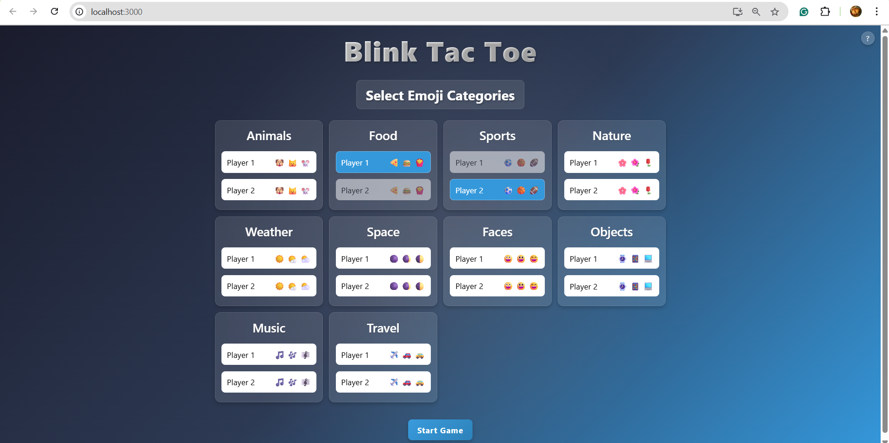

# 🎮 Blink Tac Toe

A modern twist on the classic Tic Tac Toe game, featuring emojis, animations, and a unique vanishing mechanic!

## 📸 Screenshots

<!-- Add your screenshots here -->
### Game Start


### Gameplay


### Winning Moment


## ✨ Features

- 🎯 **Modern UI/UX**: Beautiful glassmorphism design with smooth animations
- 🎨 **Emoji Categories**: Choose from 10 different emoji categories
- 🔄 **Vanishing Mechanic**: Each player can only have 3 emojis on the board at a time
- 🎵 **Sound Effects**: Immersive audio feedback for all game actions
- 📱 **Responsive Design**: Play on any device - desktop, tablet, or mobile
- 🏆 **Score Tracking**: Keep track of wins for both players
- ❓ **Help Section**: Clear game rules and instructions
- 🎉 **Winning Animation**: Confetti celebration when a player wins

## 🚀 Installation

1. Clone the repository:
```bash
git clone https://github.com/yourusername/blink-tac-toe.git
cd blink-tac-toe
```

2. Install dependencies:
```bash
npm install
```

3. Start the development server:
```bash
npm start
```

## 🎮 How to Play

1. **Select Categories**: Each player chooses a different emoji category
2. **Take Turns**: Players place emojis on the 3x3 grid
3. **Vanishing Rule**: When a player places their 4th emoji, their oldest emoji vanishes
4. **Win**: Get 3 of your emojis in a row (horizontally, vertically, or diagonally)

## 🛠️ Built With

- React.js
- Styled Components
- Framer Motion
- Emotion
- React Confetti

## 📱 Responsive Design

The game is fully responsive and works on:
- Desktop computers
- Tablets
- Mobile phones


## 📝 License

This project is licensed under the MIT License - see the [LICENSE](LICENSE) file for details.

